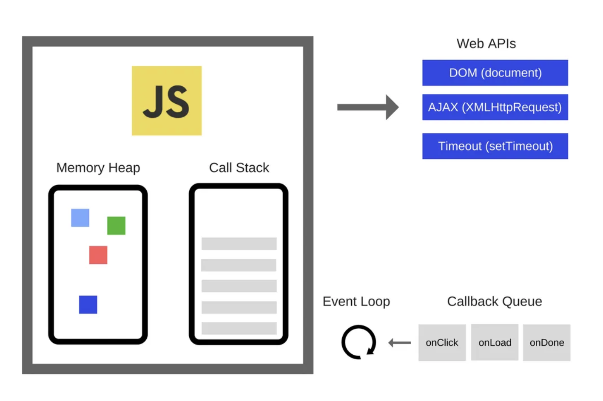
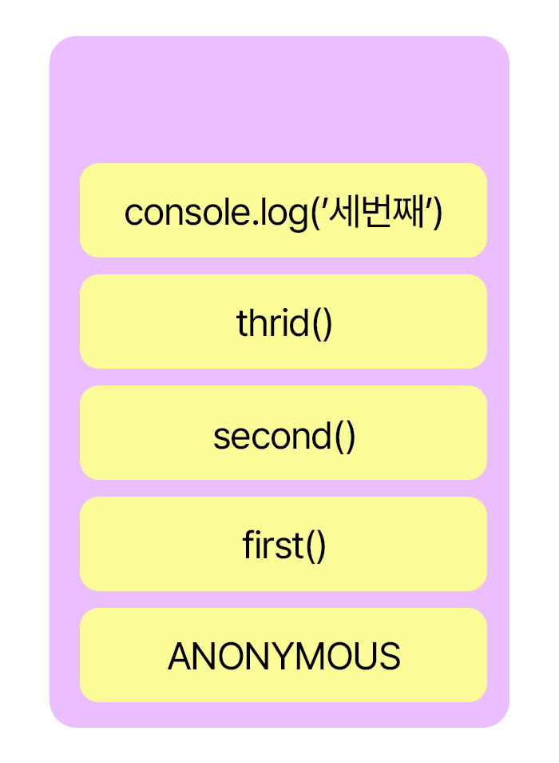
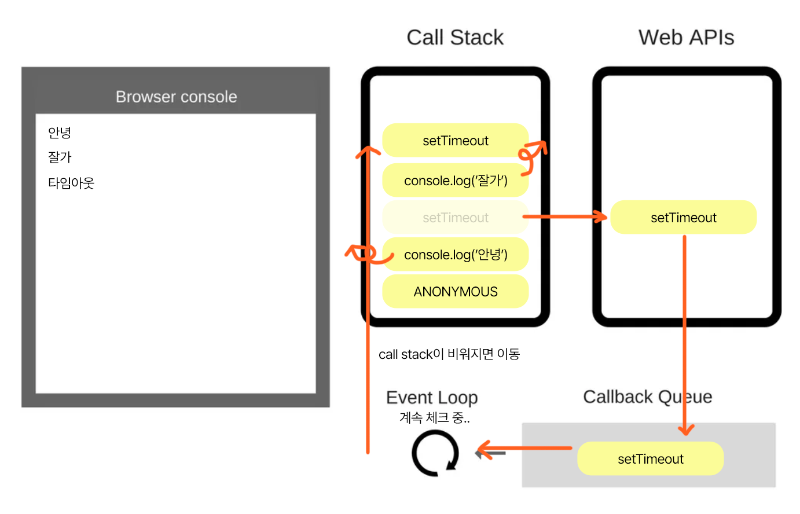

# 14.1 비동기 작업의 이해
웹 애플리케이션에서 서버 쪽 데이터가 필요할 때는 Ajax 기법을 사용하여 서버의 API를 호출함으로써 데이터를 수신한다.
<br/>
이렇게 서버의 API를 사용해야 할 때는 네트워크 송수신 과정에서 시간이 걸려서,응답을 받을 때까지 기다렸다가 전달받은 응답 데이터를 처리한다.
<br/>
이 과정에서 해당 작업을 비동기적으로 처리하게 된다.
<br/>
<br/>
작업을 동기적으로 처리한다면 요청이 끝날 때까지 기다리는 동안 중지 상태가 되기 때문에 다른작업을 할 수 없다.
<br/>
그리고 요청이 끝나야 비로소 그 다음 예정된 작업을 할 수 있는데, 이를 비동기적으로 처리한다면 웹 애플리케이션이 멈추지 않기 때문에
<br/>
동시에 여러가지 요청을 처리할 수도 있고, 기다리는 과정에서 다른 함수도 호출할 수 있다.

```javascript
function printMe (){
    console.log('Hello World!' );
}

setTimeout(printMe, 3000);
console.log('대기 중...');

// 결과
// 대기 중...
// Hello World!
```
## 콜백 함수

자바스크립트에서 비동기 작업을 할 때 가장 흔히 사용하는 방법은 콜백 함수를 사용하는 것이다.
<br/>
위 코드에서는 printMe가 3초 뒤에 호출 되도록 printMe 함수 자체를 setTimeout 함수의 인자로 전달해 주었는데,
<br/>
이런 함수를 **콜백 함수**라고 한다!

```javascript
 function increase(number,callback){
            setTimeout(()=>{
                const result = number + 10;
                if(callback){
                    callback(result)
                }
            },1000)
        }

        console.log('start')
        increase(0,result => {
            console.log(result)
            increase(result,result => {
                console.log(result)
                increase(result,result => {
                    console.log(result)
                    increase(result,result=> {
                        console.log(result)
                        increase(result,result => {
                            console.log(result)
                        })
                    })
                })
            })
        })
        
// 결과
// start
// 10
// 20
// 30
// 40
// 50
```

이렇게 콜백함수 안에 콜백을 넣어서 구현할 수 있으나, 여러번 중첩되면 가독성이 떨어지는데, 이러한 형태를 콜백헬(콜백지옥)이라고 부른다.
이러한 형태의 코드는 지양해야한다.

## Promise

위에서 본 콜백 지옥 같은 코드가 만들어지지 않게끔 방지하는 방안으로 나온 es6문법이다.

```javascript
function increase(number,callback){
    const promise = new Promise((resolve,reject) => {
        setTimeout(()=>{
            const result = number + 10;
            if(result > 50){
                const e = new Error('NumberToBig')
                return reject(e)
            }
            resolve(result)
        },1000)
    })

    return promise;
}

increase(0)
.then(number=>{
    console.log(number)
    return increase(number)
})
.then(number=>{
    console.log(number)
    return increase(number)
})
.then(number=>{
    console.log(number)
    return increase(number)
})
.then(number=>{
    console.log(number)
    return increase(number)
})
.then(number=>{
    console.log(number)
    return increase(number)
})
.catch(e=>{
    console.log(e)
})

// 결과
// 10
// 20
// 30
// 40
// 50
// index.html:16 Uncaught (in promise) Error: NumberToBig
```
이렇게 여러 작업을 연달아 처리한다고 해서 함수를 여러 번 감싸는 것이 아닌
then을 사용하여 그 다음 작업을 설정하기 때문에 콜백 지옥을 방지할 수 있다.

## async/await

Promise를 더 쉽게 사용할 수 있도록 해주는 es8 문법이다.
```javascript
    function increase(number){
        const promise = new Promise((resolve,reject)=>{
            setTimeout(()=>{
                const result = number + 10;
                if(result > 50) {
                    const e = new Error('NumberToBig')
                    return reject(e)
                }
                resolve(result)
            },1000)
        })
        return promise;
    }

    async function runTasks(){
        try {
            let result = await increase(0)
            console.log(result)
            result = await increase(result)
            console.log(result)
            result = await increase(result)
            console.log(result)
            result = await increase(result)
            console.log(result)
            result = await increase(result)
            console.log(result)
            result = await increase(result)
        } catch(e) {
            console.log(e)
        }
    }

    runTasks();
```
> 주의점 : useEffect에 등록한 함수는 async 키워드를 붙이면 안된다.<br/> 
> useEffect는 무조건 함수를 반환해야하는데,<br/>async await을 잘못쓰면 프로미스 객체를 반환하게 되어 에러가 난다.

```javascript
// 이렇게 쓰지마세용
useEffect(async () => {
    const data = await fetchUser(userId);
    setUser(data);
}, [userId]);


// 이렇게 쓰세용
useEffect(() => {
    // 이안에서 async 함수를 새로 만드세욤
    async function fetchAndSetUser() { 1
        const data = await fetchUser(userId);
        setUser(data);
    }
    fetchAndSetUser(); 2
},[userId]);
```

# 14.2 axios로 API 호출하여 데이터 가져오기
axios는 현재 가장 많이 사용되는 자바스크립트 http 비동기 통신 라이브러리이다.
<br/>
백엔드와 프론트엔드 간 통신을 쉽게 하기 위해 사용되는 것으로 Ajax처럼 사용되며,
<br/>
이 라이브러리의 특징 http 요청을 Promise기반으로 처리한다는 점이다.

```javascript
import React, { useState } from 'react';
import axios from 'axios';

const App = () => {
  const [data,setData] = useState(null);

  const onClick = async () => {
    try{
        // 데이터 불러와질때
      const response = await axios.get('https://jsonplaceholder.typicode.com/todos/1');
      setData(response.data)
    } catch (e) {
        // 에러날 때 
      console.log(e)
    }
  }
  return (
    <div>
      <div>
        <button onClick={onClick}>불러오기</button>
        {data && <textarea rows={7} value={JSON.stringify(data,null,2)} readOnly={true}/>}
      </div>
    </div>
  );
};

export default App;

```


# 14.3 news API 키 발급받기
> https://newsapi.org/register : API 키 발급
> https://newsapi.org/s/south-korea-news-api : 이번 강에서 사용할 한국 뉴스 API

```javascript

import React, { useState } from 'react';
import axios from 'axios';

const App = () => {
  const [data,setData] = useState(null);

  const onClick = async () => {
    try{
      const response = await axios.get('https://newsapi.org/v2/top-headlines?country=kr&apiKey=03e49898f8f04806aa1695cbdfcd4537');
      setData(response.data)
    } catch (e) {
      console.log(e)
    }
  }
  return (
    <div>
      <div>
        <button onClick={onClick}>불러오기</button>
        {data && <textarea rows={7} value={JSON.stringify(data,null,2)} readOnly={true}/>}
      </div>
    </div>
  );
};

export default App;

```

클릭 시 뉴스 api 데이터가 불러와진다.

# +) 자바스크립트 동작 원리 - js callstack
이번 과에서 콜백함수, promise, async await 함수들이 많이 나오는 만큼 js 함수 동작원리를 이해하면 좋을 거 같아서 정리해봅니당
> 참고사이트 : https://medium.com/sessionstack-blog/how-javascript-works-event-loop-and-the-rise-of-async-programming-5-ways-to-better-coding-with-2f077c4438b5




Memory Heap : 메모리 할당이 일어나는 곳 (주로 객체(변수,함수 등)들이 여기에 저장이 된다)
Call Stack : 실행될 코드의 한 줄 단위로 할당 되는 곳 (그래서 자바스크립트는 싱글 스레드 언어라고 하죵)
Web APIs : 비동기 처리 담당 (ajax,timeout,dom ...)
Callback Queue : Task Queue, Event Queue등 다양하게 불리우며, 비동기 처리가 끝난 후 실행되어야할 콜백함수가 차례대로 할당되고,
Call Stack이 비어져야 하나씩 실행되게 된다.
Event Loop : Queue에 할당된 함수를 순서에 맞춰 Call Stack에 할당해준다.


## **동기적인 코드**
```javascript
function first() {
    second();
    console.log('첫번째')
}

function second() {
    thrid();
    console.log('두번째')
}

function thrid() {
    console.log('세번째')
}

first();
thrid();
```
해당 코드를 실행하면 콘솔이 어떻게 찍히게 될까? 


JS를 실행하면 global execution context(anonymous)를 생성해서 콜 스택에 추가된다.<br/>
그리고 first() -> second() -> thrid() -> console.log('세번째') 순서로(아래에서 위로) 쌓이게 되고,코드는 위에서 아래로 실행되게 된다. <br/>
이런 순서대로 코드가 실행되면 결과값은 세번째, 두번째, 첫번째, 세번째 순서로 콘솔이 찍히게 된다.


### call stack error 
```javascript
function hi(){
	console.log(1);
	return hi();
}
hi();
```
해당 함수를 실행하게되면 무한재귀가 되어 call stack마다 한계점이 있는데, 이 한계점을 넘으면 사이즈를 초과했다는 에러를 확인해볼 수 있다.
브라우저마다 call stack의 한계점은 다르며, 크롬 기준 1만개의 스택이 쌓인다고 한다.


## **비동기 코드**
```javascript
console.log('안녕');
setTimeout(function () {
    console.log('타임아웃');
}, 5000);
console.log('잘가');
```

setTime함수는 대기열로 저장했다가(?) 콜백 큐로 넘긴다음에, 콜스택이 비어지면, 실행하게 되어  
결과는 안녕 잘가 타임아웃이 출력된다. 근데 만약에, setTimeout이 0초면? 

```javascript
console.log('안녕');
setTimeout(function () {
    console.log('타임아웃');
}, 0);
console.log('잘가');
```

이 역시 결과는 동일합니다