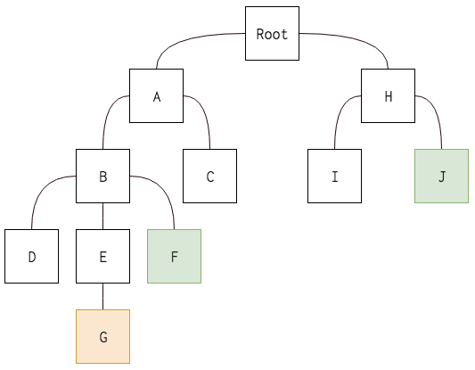
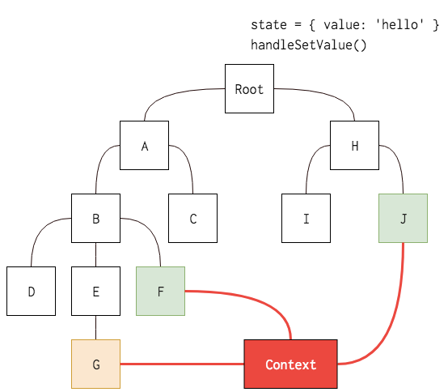

# 15장. Context API
*2024/3/26 15장 정리*
* * *

> Context API는 리액트 프로젝트에서 전역적으로 사용할 데이터가 있을 때 유용한 기능이다.


## 1. Context API 사용
기존에는 최상위 컴포넌트에서 여러 컴포넌트를 거쳐 props로 원하는 상태와 함수를 전달했다.


#### Context API 사용 시!
Context를 만들어 단 한번에 원하는 값을 받아와서 사용할 수 있다.



### 새로운 Context 만들기
createContext 함수를 사용한다.
```js
import { createContext } from 'react';

const ColorContext = createContext({ color: 'black'});

export default ColorContext;
```
### Consumer 사용
예시로 컴포넌트 안에 있는 색상을 받아올 건데, <br>
이 때 색상을 **props**로 받아오는게 아니라, **ColorContext** 안에 들어있는 **Consumer**로 조회한다.
```js
import ColorContext from "../contexts/color";

const ColorBox = () => {
    return(
        <ColorContext.Consumer>
            {value => (
                <div
                    style={{
                        width: '64px',
                        height: '64px',
                        background: value.color
                    }}
                />
            )}
        </ColorContext.Consumer>
    )
}

export default ColorBox;
```
> **Function as a child, 혹은 Render Props**
> 컴포넌트의 children이 있어야 할 자리에 일반 JSX 혹은 문자열이 아닌 함수를 전달하는 것

### Provider

Provider를 사용하면 Context의 value를 변경할 수 있다.
```js
function App() {
    return (
        <ColorContext.Provider value={{ color: 'red'}}>
            <div>
                <ColorBox/>
            </div>
        </ColorContext.Provider>
    );
}
export default App;

```
> #### Provider 사용 시 value를 명시해줘야 에러나지 않는다!!!

## 2. Consumer 대신 Hook 사용
상단에 useContext로 state값을 받고,
return 안에는 해당 state를 연결한다.
### useContext Hook
```js
import ColorContext, {ColorConsumer, ColorProvider} from "../contexts/color";
import {useContext} from "react";

const ColorBox = () => {
    const {state} = useContext(ColorContext);
    
    return(
        <ColorConsumer>
            <>
                <div
                    style={{
                        width: '64px',
                        height: '64px',
                        background: state.color
                    }}
                />
                <div
                    style={{
                        width: '32px',
                        height: '32px',
                        background: state.subColor
                    }}
                />

            </>
        </ColorConsumer>
    )
}

export default ColorBox;
```


