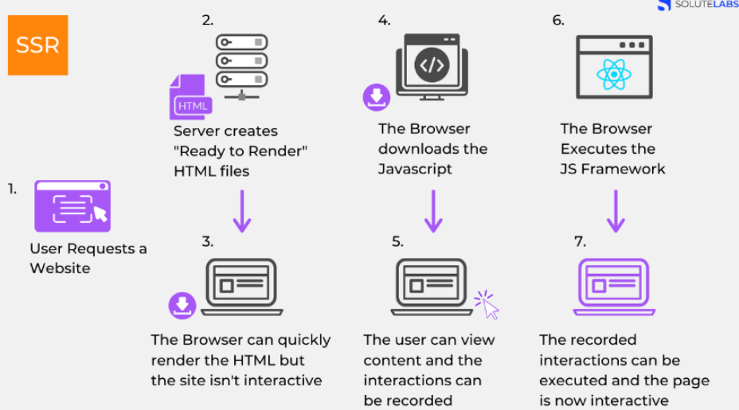
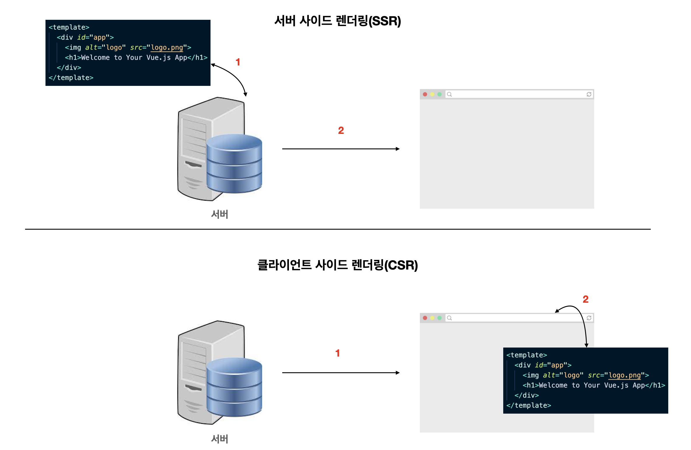

# 20장. 서버 사이드 렌더링
*2024/5/16 20장 정리*
* * *

## 서버사이드 렌더링이란?
서버로 부터 렌더링된 HTML파일을 받아와 페이지를 렌더링 하는 방식 
[/책내용/]: # (UI를 서버에서 렌더링하는 것을 의미한다.)

1. 클라이언트가 초기 화면을 로드하기 위해 서버에 요청한다.
2. 서버는 화면에 표시하는데 필요한 데이터를 읽어온 다음, 렌더링 준비를 마친 HTML을 클라이언트에게 우선적으로 전달하고, 클라이언트에게 전달되는 순간 HTML 파일은 렌더링이 되어있기 떄문에 사용자는 렌더링된 HTML을 보게 된다.(js가 읽히기 전이라서 사이트 조작 불가함)
3. 클라이언트가 js를 다운받는 동안에도 렌더링된 HTML 컨텐츠를 볼 수 있지만, 사이트 조작이 불가능하다.(사용자 조작을 기억하고 있음)
4. 브라우저가 js 다운로드를 마치면, 기억하고 있던 사용자 조작이 실행되고, 웹 페이지는 상호작용 가능한 상태가 된다.

## 클라이언트 사이드 렌더링이란?
SPA 방식으로 동작하며, 사용자의 요청에 따라 필요한 부분만 응답 받아 렌더링 하는 방식 
(gmail, twitter, google 드라이브 등..)

1. 클라이언트에서 초기화면을 로드하기 위해 서버에 요청
2. 서버는 화면을 표시하는데 필요한ㄴ 완전한 리소스의 응답이 와야 볼 수 있다.

### 서버사이드 렌더링과 클라이언트 사이드 렌더링의 차이점
어디서! 화면에 보일 페이지 내용을 그리느냐의 차이다.

클라이언트 사이드 렌더링은 페이지의 내용을 브라우저에서, 서버 사이드 렌더링은 서버에서 페이지의 내용을 다 그려서 브라우저로 던져준다.

### 서버사이드 렌더링 장점
#### 검색 엔진 최적화 & 빠른 페이지 렌더링
- 서버 사이드 렌더링은 서버에서 미리 그려서 브라우저로 보내주기 때문에 페이지를 그리는 시간을 단축할 수 있다.
- 자바스크립트 파일 다운로드가 완료되지 않은 시점에도 html 상에 사용자가 볼 수 있는 콘텐츠가 있기 때문에 대기 시간이 최소화됨으로 사용자 경험도 향상된다.
- 페이지가 로드 되기 전 콘텐츠를 렌더링할 수 있어서 검색 엔진이 콘텐츠를 쉽게 색인하고 크롤링할 수 있어서 SEO에 이상적이다.
> 검색 엔진 최적화란 구글, 네이버와 같은 검색 사이트에 검색했을 때 결과가 사용자에게 많이 노출될 수 있도록 최적화 하는 기법이다. 
> 검색엔진 봇들이 웹 사이트를 돌아다니면서 크롤링을 할때에 웹 사이트의 HTML을 분석하여 검색하는 웹 사이트를 빠르게 검색할 수 있도록 도와준다.

### 서버사이드 렌더링 단점
- 원래 브라우저가 해야할 일을 서버가 대신 처리하기 때문에 서버 리소스가 사용된다.
- 페이지 호출 시 서버에서 페이지를 구성하는 모든 리소스를 준비해서 보내기에 상대적으로 서버의 부하가 발생한다.
- 사용자가 새로고침을 하면 전체 웹사이트를 다시 서버에서 받아와야 하기에 화면의 깜빡임이 발생한다.
- 사용자에게 보여지는 시점과 사용자에게 실제로 서비스하는 시점에 차이가 있다.
